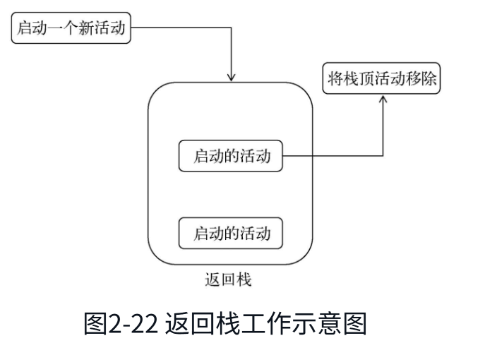
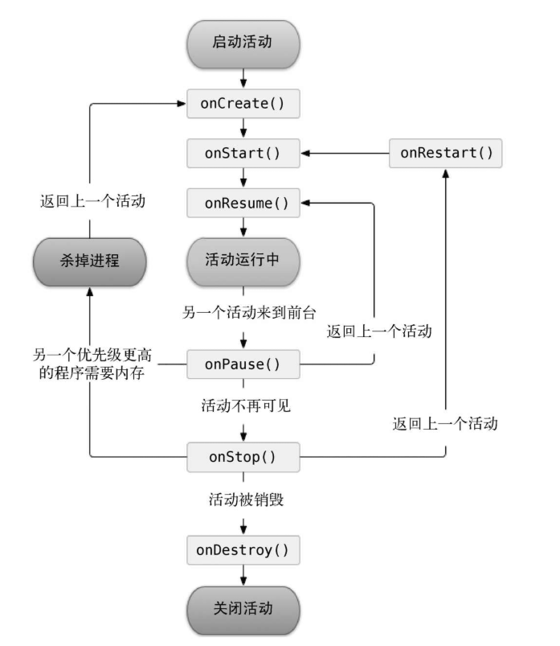
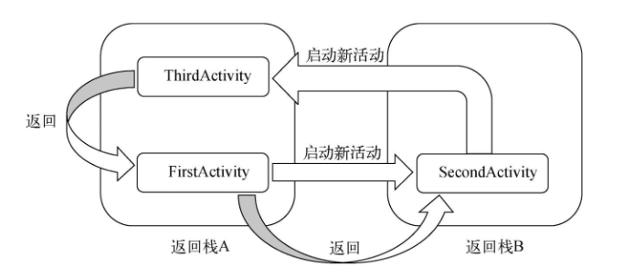

# 《第一行代码》 随书代码
# 第1章 开始启程——你的第一行Android代码
## 1.1 Android项目外层目录结构
1．.gradle和.idea\
这两个目录下放置的都是Android Studio自动生成的一些文件，我们无须关心，也不要去手动编辑。

2．app\
项目中的代码、资源等内容几乎都是放置在这个目录下的，我们后面的开发工作也基本都是在这个目录下进行的，待会儿还会对这个目录单独展开进行讲解。

3．build\
这个目录你也不需要过多关心，它主要包含了一些在编译时自动生成的文件。

4．gradle\
这个目录下包含了gradle wrapper的配置文件，使用gradle wrapper的方式不需要提前将gradle下载好，而是会自动根据本地的缓存情况决定是否需要联网下载gradle。Android Studio默认没有启用gradle wrapper的方式，如果需要打开，可以点击Android Studio导航栏→File→Settings→Build,Execution, Deployment→Gradle，进行配置更改。

5．.gitignore\
这个文件是用来将指定的目录或文件排除在版本控制之外的，关于版本控制我们将在第5章中开始正式的学习。

6．build.gradle\
这是项目全局的gradle构建脚本，通常这个文件中的内容是不需要修改的。稍后我们将会详细分析gradle构建脚本中的具体内容。

7．gradle.properties\
这个文件是全局的gradle配置文件，在这里配置的属性将会影响到项目中所有的gradle编译脚本。

8．gradlew和gradlew.bat\
这两个文件是用来在命令行界面中执行gradle命令的，其中gradlew是在Linux或Mac系统中使用的，gradlew.bat是在Windows系统中使用的。

9．HelloWorld.iml\
iml文件是所有IntelliJ IDEA项目都会自动生成的一个文件（Android Studio是基于IntelliJ IDEA开发的），用于标识这是一个IntelliJ IDEA项目，我们不需要修改这个文件中的任何内容。

10．local.properties\
这个文件用于指定本机中的Android SDK路径，通常内容都是自动生成的，我们并不需要修改。除非你本机中的Android SDK位置发生了变化，那么就将这个文件中的路径改成新的位置即可。

11．settings.gradle\
这个文件用于指定项目中所有引入的模块。由于HelloWorld项目中就只有一个app模块，因此该文件中也就只引入了app这一个模块。通常情况下模块的引入都是自动完成的，需要我们手动去修改这个文件的场景可能比较少。

## 1.2 Android项目内层目录结构
1．build\
这个目录和外层的build目录类似，主要也是包含了一些在编译时自动生成的文件，不过它里面的内容会更加更杂，我们不需要过多关心。

2．libs\
如果你的项目中使用到了第三方jar包，就需要把这些jar包都放在libs目录下，放在这个目录下的jar包都会被自动添加到构建路径里去。

3．androidTest\
此处是用来编写Android Test测试用例的，可以对项目进行一些自动化测试。

4．java\
毫无疑问，java目录是放置我们所有Java代码的地方，展开该目录，你将看到我们刚才创建的HelloWorldActivity文件就在里面。

5．res\
这个目录下的内容就有点多了。简单点说，就是你在项目中使用到的所有图片、布局、字符串等资源都要存放在这个目录下。当然这个目录下还有很多子目录，图片放在drawable目录下，布局放在layout目录下，字符串放在values目录下，所以你不用担心会把整个res目录弄得乱糟糟的。

6．AndroidManifest.xml\
这是你整个Android项目的配置文件，你在程序中定义的所有四大组件都需要在这个文件里注册，另外还可以在这个文件中给应用程序添加权限声明。由于这个文件以后会经常用到，我们用到的时候再做详细说明。

7．test\
此处是用来编写Unit Test测试用例的，是对项目进行自动化测试的另一种方式。

8．.gitignore\
这个文件用于将app模块内的指定的目录或文件排除在版本控制之外，作用和外层的.gitignore文件类似。

9．app.iml\
IntelliJ IDEA项目自动生成的文件，我们不需要关心或修改这个文件中的内容。

10．build.gradle\
这是app模块的gradle构建脚本，这个文件中会指定很多项目构建相关的配置，我们稍后将会详细分析gradle构建脚本中的具体内容。

11．proguard-rules.pro\
这个文件用于指定项目代码的混淆规则，当代码开发完成后打成安装包文件，如果不希望代码被别人破解，通常会将代码进行混淆，从而让破解者难以阅读。

Android-Manifest.xml
```xml
    <activity android:name=".HelloWorldActivity">
        <intent-filter>
            <action android:name="android.intent.action.MAIN" />
            <category android:name="android.intent.category.LAUNCHER" />
        </intent-filter>
    </activity>
```
这段代码表示对HelloWorldActivity这个活动进行注册，没有在AndroidManifest.xml里注册的活动是不能使用的。其中intent-filter里的两行代码非常重要，<action android:name="android.intent.action.MAIN" />和<category android:name="android.intent.category. LAUNCHER" />表示HelloWorldActivity是这个项目的主活动，在手机上点击应用图标，首先启动的就是这个活动。

# 第2章 先从看得到的入手——探究活动

## 2.4 活动的生命周期
### 2.4.1 返回栈

其实Android是使用任务（Task）来管理活动的，一个任务就是一组存放在栈里的活动的集合，这个栈也被称作返回栈（Back Stack）​。栈是一种后进先出的数据结构，在默认情况下，每当我们启动了一个新的活动，它会在返回栈中入栈，并处于栈顶的位置。而每当我们按下Back键或调用finish()方法去销毁一个活动时，处于栈顶的活动会出栈，这时前一个入栈的活动就会重新处于栈顶的位置。系统总是会显示处于栈顶的活动给用户。



### 2.4.2 活动状态
1．运行状态\
当一个活动位于返回栈的栈顶时，这时活动就处于运行状态。系统最不愿意回收的就是处于运行状态的活动，因为这会带来非常差的用户体验。

2．暂停状态\
当一个活动不再处于栈顶位置，但仍然可见时，这时活动就进入了暂停状态。你可能会觉得既然活动已经不在栈顶了，还怎么会可见呢？这是因为并不是每一个活动都会占满整个屏幕的，比如对话框形式的活动只会占用屏幕中间的部分区域，你很快就会在后面看到这种活动。处于暂停状态的活动仍然是完全存活着的，系统也不愿意去回收这种活动（因为它还是可见的，回收可见的东西都会在用户体验方面有不好的影响），只有在内存极低的情况下，系统才会去考虑回收这种活动。

3．停止状态\
当一个活动不再处于栈顶位置，并且完全不可见的时候，就进入了停止状态。系统仍然会为这种活动保存相应的状态和成员变量，但是这并不是完全可靠的，当其他地方需要内存时，处于停止状态的活动有可能会被系统回收。

4．销毁状态\
当一个活动从返回栈中移除后就变成了销毁状态。系统会最倾向于回收处于这种状态的活动，从而保证手机的内存充足。

### 2.4.3 活动的生存期
Activity类中定义了7个回调方法，覆盖了活动生命周期的每一个环节，下面就来一一介绍这7个方法。
- onCreate()。这个方法你已经看到过很多次了，每个活动中我们都重写了这个方法，它会在活动第一次被创建的时候调用。你应该在这个方法中完成活动的初始化操作，比如说加载布局、绑定事件等。
- onStart()。这个方法在活动由不可见变为可见的时候调用。
- onResume()。这个方法在活动准备好和用户进行交互的时候调用。此时的活动一定位于返回栈的栈顶，并且处于运行状态。
- onPause()。这个方法在系统准备去启动或者恢复另一个活动的时候调用。我们通常会在这个方法中将一些消耗CPU的资源释放掉，以及保存一些关键数据，但这个方法的执行速度一定要快，不然会影响到新的栈顶活动的使用。
- onDestroy()。这个方法在活动被销毁之前调用，之后活动的状态将变为销毁状态。
- onRestart()。这个方法在活动由停止状态变为运行状态之前调用，也就是活动被重新启动了。

以上7个方法中除了onRestart()方法，其他都是两两相对的，从而又可以将活动分为3种生存期。
- **完整生存期**。活动在onCreate()方法和onDestroy()方法之间所经历的，就是完整生存期。一般情况下，一个活动会在onCreate()方法中完成各种初始化操作，而在onDestroy()方法中完成释放内存的操作。
- **可见生存期**。活动在onStart()方法和onStop()方法之间所经历的，就是可见生存期。在可见生存期内，活动对于用户总是可见的，即便有可能无法和用户进行交互。我们可以通过这两个方法，合理地管理那些对用户可见的资源。比如在onStart()方法中对资源进行加载，而在onStop()方法中对资源进行释放，从而保证处于停止状态的活动不会占用过多内存。
- **前台生存期**。活动在onResume()方法和onPause()方法之间所经历的就是前台生存期。在前台生存期内，活动总是处于运行状态的，此时的活动是可以和用户进行交互的，我们平时看到和接触最多的也就是这个状态下的活动。


<div style="text-align: center">
  <figure>
    
    <figcaption style="font-weight: bold; margin-top: 8px">图2-23 活动的生命周期</figcaption>
  </figure>
</div>

## 2.5 活动的启动模式
### 2.5.1 standard
standard是活动默认的启动模式，在不进行显式指定的情况下，所有活动都会自动使用这种启动模式。在standard模式（即默认情况）下，每当启动一个新的活动，它就会在返回栈中入栈，并处于栈顶的位置。对于使用standard模式的活动，系统不会在乎这个活动是否已经在返回栈中存在，每次启动都会创建该活动的一个新的实例。

### 2.5.2 singleTop
当活动的启动模式指定为singleTop，在启动活动时如果发现返回栈的栈顶已经是该活动，则认为可以直接使用它，不会再创建新的活动实例。

### 2.5.3 singleTask
当活动的启动模式指定为singleTask，每次启动该活动时系统首先会在返回栈中检查是否存在该活动的实例，如果发现已经存在则直接使用该实例，并把在这个活动之上的所有活动统统出栈，如果没有发现就会创建一个新的活动实例。

### 2.5.4 singleInstance
不同于以上3种启动模式，指定为singleInstance模式的活动会启用一个新的返回栈来管理这个活动（其实如果singleTask模式指定了不同的taskAffinity，也会启动一个新的返回栈）。

<div style="text-align: center">
  <figure>
    
    <figcaption style="font-weight: bold; margin-top: 8px">图2-31 singleInstance模式示意图</figcaption>
  </figure>
</div>

# 第5章 广播机制
5.4 本地广播
本地广播的几点优势\
❑ 可以明确地知道正在发送的广播不会离开我们的程序，因此不必担心机密数据泄漏。\
❑ 其他的程序无法将广播发送到我们程序的内部，因此不需要担心会有安全漏洞的隐患。\
❑ 发送本地广播比发送系统全局广播将会更加高效。